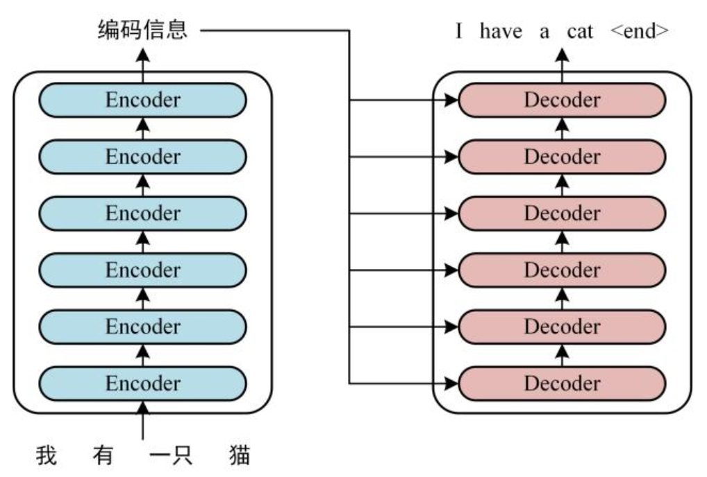
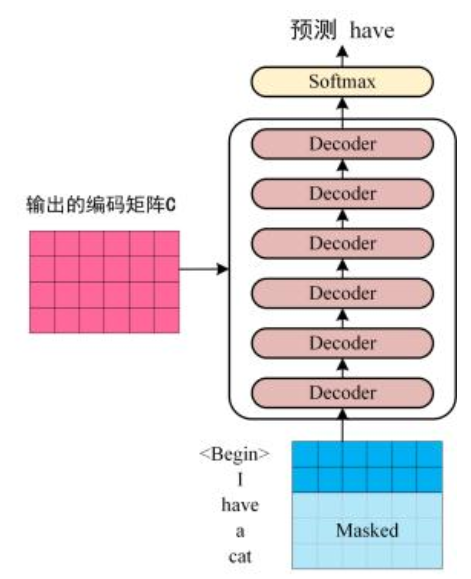

## AGI

AGI，全名为Artificial General Intelligence, 中文名通用人工智能，为人工智能的最高级形态，学习过程无需人类干预，可以处理任何跨领域任务，具有深层推理与抽象逻辑能力，同时还具有自我改进能力。

与当前的人工智能（弱人工智能）相对，是人工智能的终极目标。

## Transformer结构详解

### 整体结构
正式开始之前不妨先观察transformer是如何完成一个翻译任务的。

如图：


transformer由一组编码器结构与一组解码器结构组成，输入是一个中文句子，期望输出是一个翻译之后的英文句子。

第一步：首先获取每个单词的embedding.这个获取embedding的过程是首先得到每个单词的feature，然后叠加一个单词位置的embedding。表示为：$$x=embedding_{pos}+embedding_{feature}$$

在attention is all you need原文中约定最后得到的特征的维度是512.那么对于n个单词我们就得到了一个$n\times d$的feature matrix.

接着将这个特征矩阵送入编码器部分，最终就能得到句子各个单词的feature map--$c$.

在解码（翻译过程）中，思路是：在预测第$i$个单词的时候只能根据第$1\sim i-1$个单词的特征来预测，盖住（mask）后面从$i+1 \sim n$的单词。



### 细节
先谈如何得到单词的embedding.方法有很多，先前的word2vec, glove算法等都可以用。

而要采用时间步嵌入的原因，是transformer没用RNN结构，导致顺序信息不能显式利用，而这部分信息对于NLP任务是非常重要的。因此直接在embedding中加入这部分信息。方法也有很多，可以通过learnable的函数学，也可以直接按照公式嵌入。原方法使用了后者，采用余弦嵌入。
$$
\begin{aligned}
PE_{(pos, 2i)}   &= \sin\left(\frac{pos}{10000^{2i/d}}\right) \\
PE_{(pos, 2i+1)} &= \cos\left(\frac{pos}{10000^{2i/d}}\right)
\end{aligned}
$$

接着是transformer的精华：自注意力机制。
每一个encoder和decoder的结构如下：


红色框框的部分是多头注意力机制部分，每个multi-head里面有多个self-attention块。

每一个自注意力块对输入特征x做了这件事：
>令特征x依次乘以矩阵$W_{Q},W_{K},W_{V}得到矩阵Q，K，V$。

之后就能得到自注意力输出：

$$attention(Q,K,V)=softmax(\frac{QK^{T}}{\sqrt{d_{k}}})V$$

这里的$d_{k}$是矩阵Q,K,V的向量维度，即列数。主要是为了防止内积过大。其中的Q，K是询问-键对，用于询问一个句子中各个其他的单词对于某个单词的重要性/关联性。V表示注意力权重，对信息进行聚合。

而多头注意力机制则是对一个特征图$x$进行多次self-attention运算（假如说n次），最终就得到了n个输出$z_{x}$.我们选择将n个$z_{x}$concat，再通过线性层改变形状即可得到多头注意力机制的输出$z_{final}$,形状与输入的特征矩阵是一样的。

## VIT


## 


## torch面经
1）cat()和stack()的区别是什么？

cat将张量在原有的维度上拼接，stack在新的维度上对接。
例如两个[2 x 3]的张量，使用cat会得到一个[4 x 3]的张量，使用stack会得到一个[2 x 4 x 3]的张量。

2）神经网络的梯度下降能优化非凸函数吗？

可以，虽然对于非凸问题局部最小不一定为全局最小，但现代神经网络通过引入优化器特化每个参数更新的学习率来确保模型确实在往损失下降的方向走。

以adam优化器为例，adam为每个参数维护一个EMA（指数移动平均值），根据梯度的一阶矩和二阶矩来更新每个参数变化的步长：
$$m_t=\beta_{1} \cdot m_{t-1}+(1-\beta_{1} \cdot)g_{t}$$

$$v_{t}=\beta_{2} \cdot v_{t-1} + (1-\beta_{2})\cdot g_{t}^2$$

参数更新:
$$\theta_{t}=\theta_{t-1}-\eta \cdot \frac{m_t}{\sqrt{v_t}+\epsilon}$$

其中$\epsilon$是为了防止分母为0的小数。

3）定义一个神经网络模块的大致方式：

- 定义一个类，使其继承torch中nn的模块作为神经网络的模块。
- 使用_init_()初始化好有哪些层（卷积，池化，循环）......
- 定义前向传播过程。
- 输出结果。

参考代码：
```
import torch
import torch.nn as nn
 
class SimpleNN(nn.Module):
    def __init__(self):
        super(SimpleNN, self).__init__()
        self.fc1 = nn.Linear(10, 20)  # 输入维度为 10，输出维度为 20 的全连接层
        self.relu = nn.ReLU()
        self.fc2 = nn.Linear(20, 2)  # 输入维度为 20，输出维度为 2 的全连接层
 
    def forward(self, x):
        x = self.fc1(x)
        x = self.relu(x)
        x = self.fc2(x)
        return x
 
# 测试模型
model = SimpleNN()
input_data = torch.randn(32, 10)  # 32 个样本，每个样本有 10 个特征
output = model(input_data)
print(output.shape)
```
4）pytorch是如何计算函数梯度的？
使用计算图，大致的torch计算梯度流程是：

- 定义需要计算梯度的函数。
- 将require_grad( )设置为true。
- 调用backward( )计算梯度。

5）pytorch如何自定义损失函数并进行训练？
接上文通过forward() 前向传播得到模型输出，在forward()中再自定义好损失函数接受输出并计算损失，由forward()返回损失，再调用backward()即可反向传播。

梳理一下，整体流程是：
- 优化器梯度清零。
- 前向传播得到输出。
- 通过损失函数计算损失。
- 损失函数反向传播。
- 优化器动态调整学习率。

6）简单讲一下hook：

hook是torch中一种无需改动其他代码，即可在forward或者backward过程中返回梯度热力图或者参数情况的机制。

7）梯度爆炸或消失有哪些可能？

先看梯度消失。

- 激活函数选择不当，梯度开出来为0。
- 网络过深，如果每层梯度小于1，那么累乘之后数字非常小。
- 初始化权重值过小。
- 每一层之后没有归一化操作。

再看梯度爆炸：

- 网络层过深且无归一化也有梯度爆炸的可能。
- 学习率过高，加大梯度更新震荡幅度。
- 损失函数设计不当。

