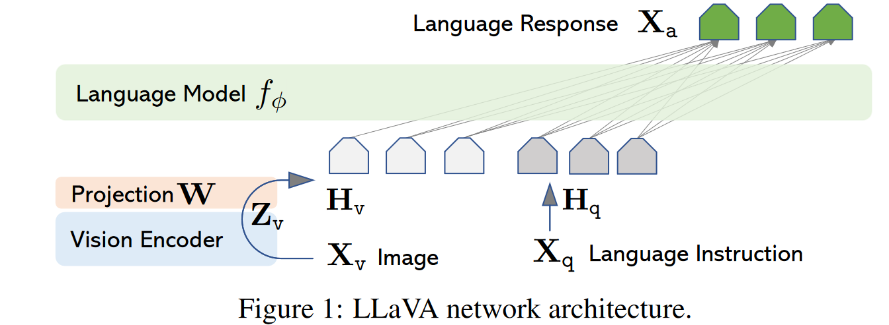

传统LLM已经大量使用纯文本指令进行微调，以期让LLM适应更加复杂的下流任务。例如文本：

>对这段论文的内容进行分点？

但是在多模态大模型领域还没有广泛采用这样的技术。现在多模态模型，尤其是vision-text多模态模型，通常还是用文本-图像对进行训练，这样LMM只能学习简单的图像-文本相关性联系，但是无法做更复杂的比如推理之类的任务。本篇论文提出也将简单的text-image pairs转换为标准的，多模态指令微调数据，使得LMM也可以依据这些构建的数据集进行微调，以期使LMM能够胜任更加复杂的任务，例如：

  **指令**：描述这张图片中的物体及其关系
  **输入**：[图像：厨房里，一只猫打翻了一瓶牛奶]
  **输出**：厨房地板上有一滩打翻的牛奶，旁边站着一只猫，猫正盯着牛奶。

生成高质量的用于图像-文本指令跟随微调的数据的方法也很重要。一种传统想法是使用GPT读入图像然后生成图像的简单问题。但这种做法可能会导致生成的指令微调数据的推理层较浅，即提的问题较为简单，对微调没有太大作用，例如：

>图中有哪些物体？

对此文章提出另一种方法，首先将图像-文本转换为符号化描述，例如caption + bounding box的形式。其中caption可以详尽描述图中的情景，和所有物体，以及可能的相应关系，bounding box可以描述物体的位置，或者表面颜色，纹理等等细节。这样一张图片就被转换成了可以更好被LLM理解的符号化形式。举个例子：

>Caption: 一群孩子在公园里踢足球，背景有树木和长椅。  
   Bounding Boxes:  
- 孩子: (0.1,0.1,0.4,0.3), (0.5,0.2,0.8,0.4)  
- 足球: (0.3,0.5,0.5,0.7)  

下一步还需要人工给予少量种子示例指导LLM如何问出所想要的高质量问题，例如：

>图中的孩子是否适合用来作某儿童营养品的广告？
>图中的人物彼此之间可能是什么关系？

现在先使用GPT生成大量符号化图像数据，再结合少量种子示例，就可以指导GPT模型生成大量高质量图像-文本微调指令数据。

结构图如下：

使用off the shelf 的视觉编码器（CLIP等），将图像转换为与语言空间同步的embedding,然后通过线性变换

$$H_V=Z_{v}*X_{v}$$

就得到了一系列文本-图像可以用来训练模型。

具体训练过程是：首先generate一个多轮问答序列，接着在训练的时候遵从这样的原则：

- 第一个问题：[图像]图片中有什么内容？
- 后续问题，随机选取一个问题出来

使用自回归方法训练，仅通过上文，给出当前问题的答案，并极大化模型输出与助理给出的答案的似然。