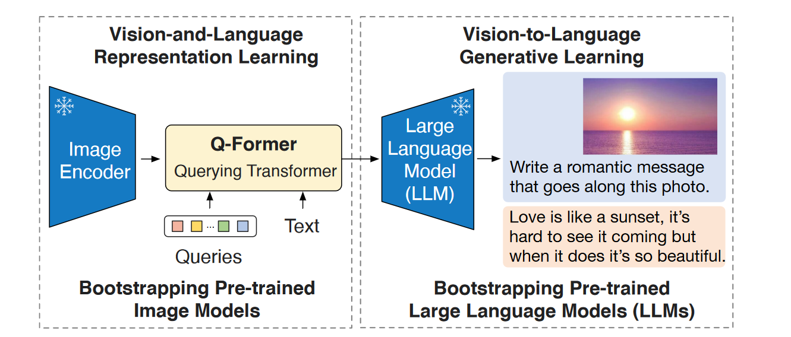
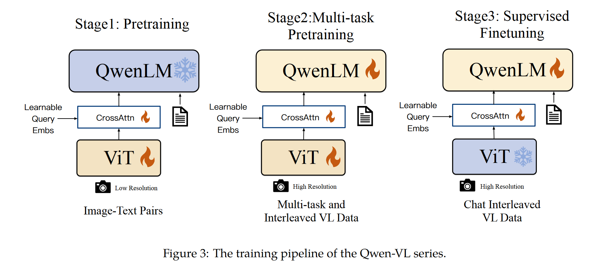
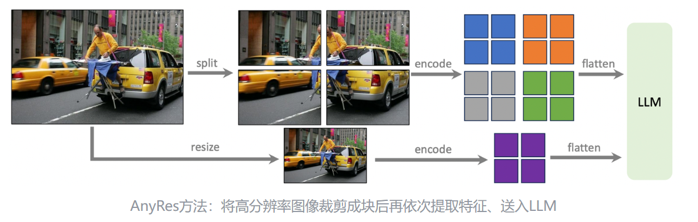

## Blip-2
设计思路：原有的图像-视觉语言模型训练所需考虑的参数量非常庞大，预训练代价很高。因此想到不妨利用现成的视觉编码器和语言模型。但同时需要考虑到, Image Encoder 与 LLM 之间存在模态对齐的问题。为了弥补这个gap, BLIP-2提出了核心思想：

>利用现成的视觉编码器与LLM分别处理视觉信息与文本信息，通过引入一个额外的大模型实现视觉-文本特征空间的转换，并起到信息瓶颈的作用，最终生成文本信息，并高质量完成视觉任务。

BLIP-2结构图：

使用冻结视觉编码器提取视觉特征，再用预训练好的Q-Former提取在文本特征空间中信息最丰富的视觉表示，这是第一阶段。在第二阶段，Q-Former将提取的视觉特征送给下游冻结LLM作为视觉信息提示，从而产生文本信息。Q-Former输出维度远小于视觉编码器，还能起到信息瓶颈强迫提取最有用表示的作用，对抗遗忘灾难。

Q-Former一阶段的训练方式是通过优化图像-文本对比，图像-文本匹配，与基于图像文本生成学习三个目标进行。二阶段是利用冻结的Image Encoder将视觉表示输入Q-Former，将Q-Former给出的视觉特征经过线性层对齐之后与前缀结合再送给LLM，最终给出文本表示并根据模型结构设计损失目标。

## InternVL
并没有提出新颖的方法，但是将视觉基础模型的参数量扩大了数十倍，之后的多模态foundation model可以像神经网络一样继续朝着大而深的方向深挖。是对QFormer系列的改进。主要解决的问题：
- 使用娇小的QFormer充当粘合剂弥补视觉模块与LLM之间的表示差距可行，但是视觉编码器的参数严重小于当下LLM的，因此LLM的表征能力受到了严重的限制。
- 毕竟是对视觉模型的表示做简单变换映射到LLM的特征空间，视觉表示和文本表示不连续。

很自然想到这个方法：继续扩展基础视觉模型的参数量，使visual encoder的表达能力追上LLM，并引入新的LLM替代原本的QFormer，通过新LLM的强大表达能力更好地提取视觉特征，并实现视觉特征到文本特征的过度。

编码器采用VIT，LLM middleware采用LLAMA家族的模型。

训练阶段采用一种比较progressive的手段：一阶段采用类似CLIP的训练方式，只是组件参数量更大；二阶段利用更高质量的VQA以及其他视觉语言问答数据集，进行生成训练；三阶段采用更高质量的人工标注或者其他数据集，对具体任务进行监督微调。

## QwenVL
阿里团队的多模态模型，整体结构与InternVL非常相似，但是参数量少很多。

整体架构没有变化，一个视觉编码器+作为midleware的大模型+一个最终输出文本的LLM，这套结构中的middleware额外引入了一个visual adapter，通过锁住learnable query的数量强行限制视觉编码器输出的特征量，在计算效率和训练效果间取得了trade off。adapter输出的表示还会嵌入位置编码防止位置细节丢失。视觉编码器采用了定制的CLIP变体，对图像中物体位置和纹理细节关注度更高，输出格式也是经过归一化之后，按照bounding box--文本描述--区分占位符 的形式送入下流LLM。下游LLM采用了自家的qwen-7B进行初始化。

训练过程和InternVL的渐进式训练有所不同，分别采用了低分辨率-高分辨率-VQA数据集的形式进行训练。

## LLAVA-1.5
LLAVA家族都是结构极简的多模态大模型，但是性能非常好。LLAVA-1.5在LLAVA的基础上主要做了些小改动：
- 将原本的在视觉编码器和大语言模型之间的线性层替换成双层MLP。
- 采用更多样的训练数据，包括高质量的学术问答数据集VQA，以及高分辨率图片。
- 规范化prompt格式，令mllm可以兼顾短答案应答与长答案详细说明能力。

比较有意思的是应用高分辨率图像训练的方法。因为CLIP变体能够处理的分辨率上限只有$336^2$，而如果采用VIT那么一方面需要重新训练非常麻烦且昂贵，另一方面推理的时候能用的图像的分辨率就被固定在高分辨率区间了。文章提出一种“分而治之”的方法，将图片分成若干小块，对每个小块encode一次最后拼成一张大的特征图。送入下游LLM的时候额外链接下采样图像的特征提供位置信息。

## Video-LLAMA
### Challenge
过往的mllm在视频理解方面暂时局限于视觉信息理解，而忽略了video中丰富的音频信息。于是提出可以利用类似于训练视觉编码器的方式训练音频编码器，将听觉信息也映射到llm的特征空间中对齐。

训练听觉编码器的方式是采用了Imagebind对audio模态进行对齐。由于目前还没有大量audio-caption数据集，因此只能采用大量视觉-文本对作为代餐，这也导致了训出来的模型面对音频信息的幻觉比较严重，目前需要构建大规模高质量音频-文本数据集。

