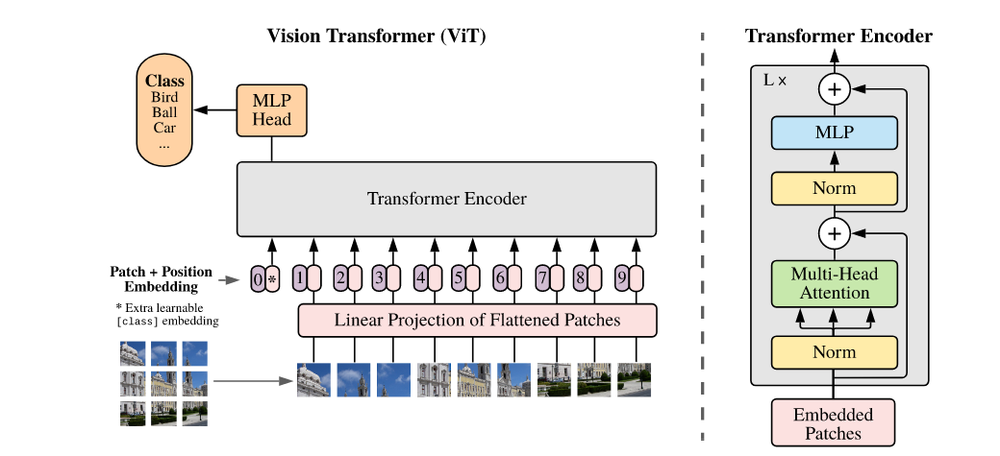
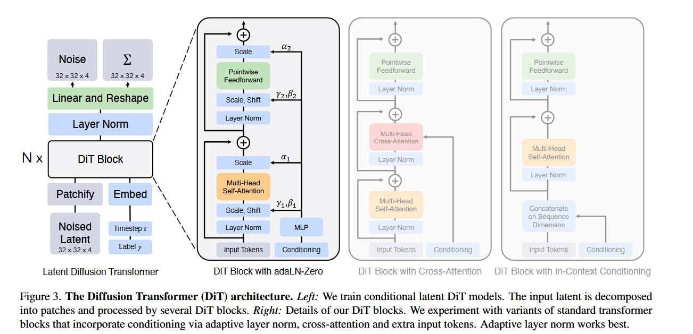

Dit系列模型已经成为了AIGC领域几乎所有方法的backbone与核心组件。在正式开始了解Dit相关内容之前先来看看Dit的前置工作--Vit。

## Vision Transformer

Vit是一个encoder-only结构模型，它将一张image分patch卷成embedding, 通过多层attention block学到描述这个image类别的token--cls token，这个cls token被送入mlp分类头中预测类别，或用来做其他下游任务。

### patch embedding
为了方便描述，我们假设我们有一张`224x224x3`的image，我们约定`patch_size`=`14x14`, 所有隐层维度`D=768`。

容易得到我们期望获得`224x224/(14x14)=16x16=256`个patch。实际操作中，我们用一个`kernel_parameter={kernel_size=14x14, output_channel=D=768, input_channel=3}`的卷积核，对每一个patch得到长度为1x768的token序列。我们期望有256个token，则最终得到一个256x768的embedding。由于设定D=768，最后我们随机初始化一个形状为1x768的token，作为cls token加在patch embedding 最前面，至此我们得到257x768的embedding.最后对embedding加上可学习的2D位置编码，得到完整patch_embedding。

### Vit encoder

encoder block结构如图：



送入patch_embedding之后做自注意力机制时过程如下：

```
# cls token作为query，可以关注所有位置（包括自己和所有patch）
Q_cls = cls_token @ W_Q  # cls token的query向量
K_all = all_tokens @ W_K  # 所有token（cls+patches）的key向量  
V_all = all_tokens @ W_V  # 所有token的value向量

# cls token的注意力计算
attention_weights = softmax(Q_cls @ K_all.T / sqrt(d_k))  # [1, 257]
# 权重分布：对自己、patch1、patch2...patch256的注意力

# 信息聚合：cls token获得所有token的加权组合
new_cls_representation = attention_weights @ V_all  # [1, D]

```

可以认为是cls token通过自注意力机制变相地从各个patch中提取信息。cls token通过询问整合了其他所有patch embedding 的信息。

后面用得到的表示训下游分类头：
```
# 预训练阶段：MLP分类头
logits = classification_head(cls_representation)  # [B, num_classes]
# 微调阶段：简单线性层
logits = linear_head(cls_representation)  # [B, num_classes]

# 计算交叉熵损失
loss = CrossEntropyLoss(logits, true_labels)  # 标量

# 反向传播
loss.backward()  # 梯度传播到所有参数

# 梯度更新的参数包括：
# - cls_token参数
# - patch embedding的线性投影权重  
# - 位置嵌入参数
# - 所有Transformer层的权重（attention、MLP）
# - 分类头权重
```

## Dit
把DDPM的U-net结构换成了VIT组件。整体过程：

```
预训练 VAE：E（编码）、D（解码）。

Patchify + 位置编码：将 z_t→token 序列。

条件嵌入：t、c→d 维条件向量。

Transformer 主干：N 层 ViT-style block（推荐 adaLN-Zero 版）。

线性解码器：token→重排为拼接的噪声与对角协方差通道
```

将时间步与类别等嵌入的方法和Vit嵌入cls token的方法类似，最初随机化一个维度相同的token，跟patchify之后的image embedding放一起过Vit blocks。经过encoder编码之后的token是高维度特征，通过decoder的单线性层（可训练）将token从 $T \times d$ 转回 $p \times p \times c$的形状，再线性解码得到预测的噪声和对角协方差。



### Trainging

- 现有的image，采样时间步，采样噪声
- image，时间步，噪声送入scheduler得到对应去噪步骤下的latent image
- latent image送入Dit的encoder，decoder预测到噪声
- 预测噪声与实际噪声做损失计算并反向传播

### Inference

- 得到条件嵌入，采样纯噪声分布，并指定时间步数
- 过encoder，decoder迭代去噪得到最终图像

  