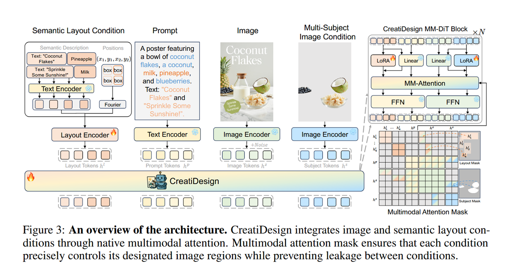

## 几个评价指标

图形设计的要求相比普通2D生成多了一些在美观和可编辑性方便的要求，有这几个比较常用的指标：

- GPT-4V:用gpt在几个维度指标方面打分，例如layout（空间布局是否合理），compliance(设计是否符合用户的prompt),color(颜色整体有无违和感)，Graphic Style（元素图形的美观性）

- 人工打分。

## CreatiPoster

图形设计的几个要求：
- 文本准确性。
- 资产保真性，最终生成的图形设计中用到的元素必须和用户所提供的assets保持一致。
- 可编辑性，如果用户想要替换其中的元素或者仅仅修改文字，必须要方便修改。
- 美观，设计要符合审美。 

于是CreatiPoster将生成任务分散到了两个模型上，一个Protocol model和一个background model，前者负责接收用户的assets和prompt，然后对每个layout(一个text或者image算一个layout)生成详细的json描述属性：大小，位置，字体等等，同时还可以给出每个layout所想要的背景的简洁需求。接着将所有json文件送入引擎比如Skia等就可以渲染得到foreground文件，最后将foreground和promt送入background model就能得到所需的背景，background + foreground拼接就可以得到完整的图形设计。

总体来看：
系统工作流程
第一阶段 - 协议生成：
用户输入 → 协议模型 → JSON协议规范

第二阶段 - 前景渲染：
JSON协议 → Skia等渲染引擎 → 完全可编辑的前景图层

第三阶段 - 背景生成：
前景图像 + 背景提示 → 背景模型 → 匹配的背景图像

第四阶段 - 最终合成：
前景 + 背景 → 完整的多层图形设计

前景模型（FM）训练时采用了两种范式，prompt-only和prompt-assets两种，前者提供描述即可，由引擎渲染出前景，送入BM即可得到背景；后者会先捕捉资产特征，然后在渲染的时候注意指定assetes的摆放位置以及其他特征。

[arxiv](https://arxiv.org/abs/2506.10890#:~:text=In%20this%20paper%2C%20we%20introduce%20CreatiPoster%2C%20a%20framework,multi-layer%20compositions%20from%20optional%20natural-language%20instructions%20or%20assets.)

## CreatiDesign
### Content

**Motivation:** 指出图像设计可以分为主体视觉元素，次要视觉元素与文本元素三个关键模块，要同时综合好三类视觉元素的生成比较困难。以往的专家模型只能专注于一类条件，通用模型同时处理好多个条件的能力较弱。

关键问题：**如何以统一方式整合多个异构条件，如何在实现和谐构图的同时保持每个条件的细粒度可控性。同时也缺乏细粒度、多条件注释的即用型图形设计数据集。**

**Method:** 设计统一所有条件的统一生成框架（本质上是所有条件的token做交叉注意力），并通过独特的掩码设计严格控制各个模块的关注范围，从而限定生成过程中各个部件只能严格控制一块区域，对多轮编辑以及局部修改等场景帮助很大。模态加完之后使用LORa微调。

方法主体图：

训练时采用四个模态的信息：原始目标图像（VAE），多主体视觉元素的条件编码（VAE），次要视觉元素和文本的：1.文本描述 （T5 text-encoder）2.bounding box（傅里叶编码），整体图像的语言描述（T5 text-encoder）。

### Improvement
- 往以FLUX为backbone的MM-DIT中加一个模态：blend-mode，合成时更好地保持视觉风格

### Data/Experiment
一条自动产数据的流水线：

训练集：400K个流水线产生的样本
验证集：1000

评估用自己搭建的benchmark，核心指标是多主体视觉元素信息保留，和语义对齐程度，用IRScore和PickScore评估图像指令跟随程度和构图是否和谐等。

用LoRA rank=256微调FLUX，batch_size=8, 100K步，8张H20上微调四天。每个layout的文本描述<=30 token, 一张image最多10个layout

[arxiv](https://arxiv.org/abs/2505.19114)

## CreatiLayout
第一次将layout作为图形设计中与图像/文本同等重要的模态输入。但是注意到相比较于文本/视觉这种模态，layout布局这种模态的信息处于劣势，直接将layout的token与vision token和text token拼接会导致layout的作用非常小。
采用连体MM-attention结构：

Layout token这块，layout的token为：
$$h^l_i = MLP([τ(c_i), Fourier(b_i)])$$
其中$$τ(c_i)$$是文本编码器对该layout的文本标题的编码，$$Fourier(b_i)$$是对layout bounding box的位置编码。

接下来分别做image-layout和image-text两套MM-attention，将得到的token直接相加：
$$h^siamese_z = h'_z + h''_z$$
计算损失：
$$L_{layout} = E_{z,p,l,t,ε~N(0,1)}[||ε - ε_{θ,θ'}(z_t, t, p, l)||²_2]$$

训练流程
1. 预处理：冻结预训练模型，仅训练新增参数θ'
2. 模态处理：
  - 图像tokens通过patch化潜在表示z获得
  - 文本tokens通过文本编码器处理全局描述
  - 布局tokens通过布局编码器处理
3. 多模态交互：通过两个连体MM-Attention分支并行处理
4. 损失计算：结合标准扩散损失和区域感知损失

训layout designer：从自建数据集中抽一部分出来，按照三个任务训layout designer: 
- 描述->布局生成，给定全局prompt描述生成具体各个实体的布局
- 给定中心点->布局生成
- 次优布局->布局生成，次优布局是指对正确的布局做一些扰动，比如删除某些实体，修改某些实体的信息

推理流程
1. 输入处理：接收全局描述（用户描述目标设计的效果）和布局条件（包含N个实体，用户可以只给出粗略描述，由layout designer 规划每个元素bounding box应该是什么样的）
2. Token化：将三种模态转换为对应的token表示
3. 噪声预测：通过SiamLayout网络预测噪声
4. 条件控制：仅在前30%的去噪步骤中应用布局条件
5. 图像生成：通过VAE解码器重构最终图像
Data/Experiment
dataset
layoutSAM数据集：{原始图像，各个实体的bounding box与标题，全局文本描述}
Pipeline
1. 洗数据，LAION得分过低和文本根本认不清的数据筛掉
2. 图像交给qwen，提供文本prompt
3. 第二步的详细长文描述送给Llama3.1微调，输出对每一个实体的短文本描述
4. 用Grounding DINO得到每个实体的bounding box
5. 用MiniCPM-V-2.6视觉语言模型，结合原图像，bounding box和每个实体的文本描述重新给出对每个视觉元素的描述

