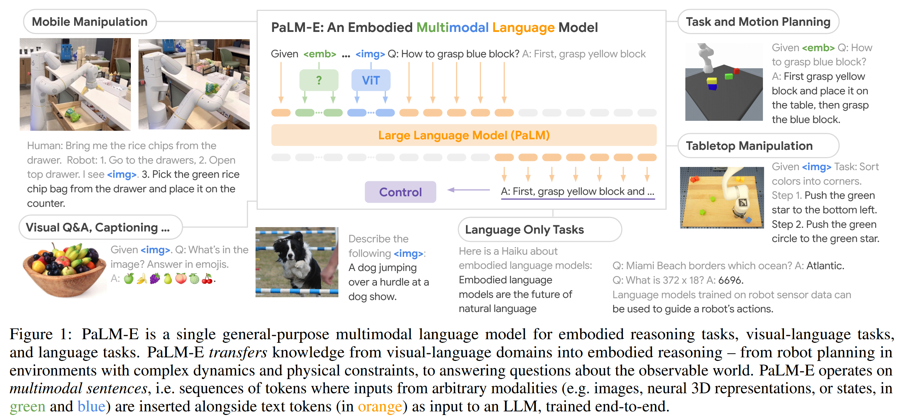
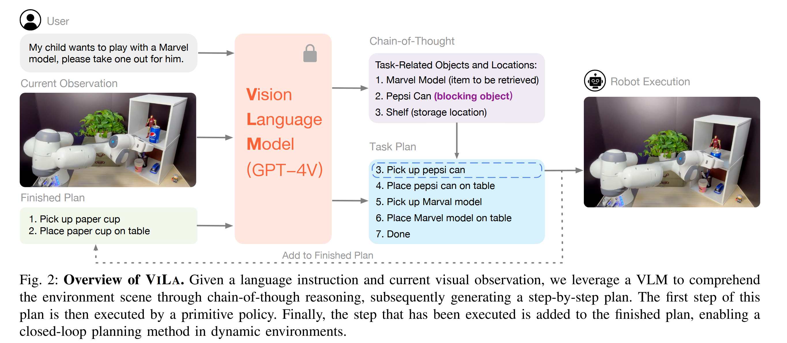
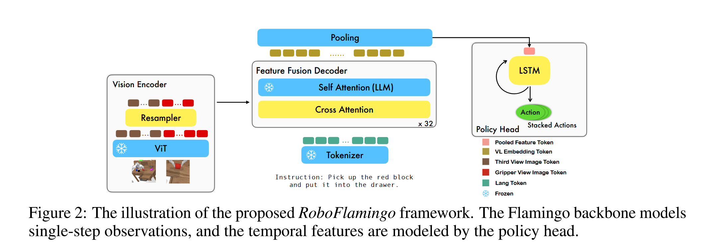

## RT-1
insight
提出了robotics transformer,机器人控制通过语言指令和视觉图像，那么现在尝试将语言指令和视觉图像压缩成密集的token，作为序列送入transformer中，并令其对指令/视觉信息序列和动作序列应用交叉注意力机制捕捉二者之间的联系，这样就可以令transformer学习如何根据指令与图像推出对应的动作序列，接着应用在下游机器人动作上。


[zhihu](https://zhuanlan.zhihu.com/p/675317460).

[arxiv](https://arxiv.org/abs/2212.06817).

## RT-2
insight
RT-1的问题是：机器人数据非常少，利用transformer专门特定学习指令-视觉与动作序列对的关系需要人工标注海量数据，成本高昂不现实。可以考虑利用已经在互联网级别数据上预训练好的VLM来完成机器人动作的控制任务。

最大的问题是将VLM的输出和机器人动作序列匹配。采用的策略是使用自然语言精确描述机器人将要采取的动作，要做到这一步只需要将机器人数据构造成VQA格式即可，例如：

```
VQA format “Q: what action should the robot take to [task instruction]? A:......”
```

RT-2也有几个显著的缺点。第一点，RT-2只能通过预训练学到更加丰富的语义信息，了解具体场景并知道该做什么，但是无法学到新的动作。RT-2的动作能力受限于训练数据中已有的技能分布。例如，如果训练数据中只包含“抓取”和“移动”两种动作，RT-2无法凭空学会“旋转”或“跳跃”。这一点未来可以通过丰富数据集中的动作种类来解决；第二点，RT-2采用了VLA，视觉语言模型参数量非常庞大，面对需要高频推理的机器人控制（一秒内可能需要上百次决策）无法做到实时推理，并且成本高昂，这个问题未来可通过模型蒸馏与量化来解决。

[arxiv](https://arxiv.org/abs/2307.15818)

[zhihu](https://zhuanlan.zhihu.com/p/668907606)

## Palm-E
insight
正式将多模态大模型的概念引入了具身智能中。与RT系列对比，并不再只是将观测序列和状态序列作为简单的序列送入transformer中做交叉注意力，而是采用各类编码器将各种模态的信息与LLM的特征空间对齐。



普通VIT将图像划分为不同的patch然后学习特征，这样缺乏对象意识，比如清晰地捕捉到图像中有几个需要操作的目标物体，而不是简单描述图像不同部位的特征，为了弥补这一点感知序列encoder方法采用了OSRT。

[arxiv](https://arxiv.org/abs/2303.03378)

## ViLa


整体思路和Palm-E非常相似，但又貌似做了一些阉割，没有用其他的模态，只有视觉和语言，只是简单调用了下gpt-4v作为推理得到动作序列的VLM。总体来说没有什么insight，工程性非常强。

但是论文中间的讲述比较有意思，现有的多模态框架更像是将LLM作为一个盲人，各类affordance model作为眼睛提供给LLM信息，并没有太多视觉--语言之间的推理。虽然文章解决这一问题的方法也很粗暴，直接调了gpt-4v。后面作为现实场景的即时反馈的方法是拍照，将视觉信息再传回VLM进行决策。

## RoboFlamingo
把VLM做决策的部分（输出机器人具体动作）和进行观测的部分做了解耦，这样因为被拆开了，两方面都可以做各自的特化并进行scale。



具体来说中间VIT的采样器，交叉注意力层的参数和决策头用的模型参数是可以调整的，而其他地方使用Flamingo的先验知识。整体框架经过两步：第一步预训练，第二步使用模仿学习方法让agent学习专家动作。策略是最大化专家动作的似然：
$$\ell = \mathbb{E}_{(\tau, l)_i \sim D} \left[ \sum_{t=0}^{|\tau|} \log \pi_\theta (a_t | o_t, l) \right].$$

论文中的训练函数分别用MSE计算爪子位置的损失，用BCE计算爪子的动作达到最大化似然。

文章最大的insight在于第一次把自然语言指令下机器人长时间步动作执行的问题放到台面上，并采用决策头与观测解耦的方法，引入能够很好处理序列历史状态信息的模型来加强这方面的决策。

[arxiv](https://arxiv.org/abs/2311.01378)
[notion](https://www.notion.so/RoboFlamingo-1c2c4bccb03b806abfb6f187ce5b1cc7)

## OpenVLA