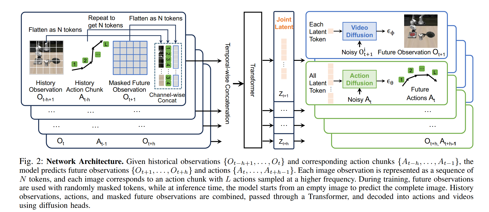

## RT-1
insight
提出了robotics transformer,机器人控制通过语言指令和视觉图像，那么现在尝试将语言指令和视觉图像压缩成密集的token，作为序列送入transformer中，并令其对指令/视觉信息序列和动作序列应用交叉注意力机制捕捉二者之间的联系，这样就可以令transformer学习如何根据指令与图像推出对应的动作序列，接着应用在下游机器人动作上。


[zhihu](https://zhuanlan.zhihu.com/p/675317460).

[arxiv](https://arxiv.org/abs/2212.06817).

## RT-2
insight
RT-1的问题是：机器人数据非常少，利用transformer专门特定学习指令-视觉与动作序列对的关系需要人工标注海量数据，成本高昂不现实。可以考虑利用已经在互联网级别数据上预训练好的VLM来完成机器人动作的控制任务。

最大的问题是将VLM的输出和机器人动作序列匹配。采用的策略是使用自然语言精确描述机器人将要采取的动作，要做到这一步只需要将机器人数据构造成VQA格式即可，例如：

```
VQA format “Q: what action should the robot take to [task instruction]? A:......”
```

RT-2也有几个显著的缺点。第一点，RT-2只能通过预训练学到更加丰富的语义信息，了解具体场景并知道该做什么，但是无法学到新的动作。RT-2的动作能力受限于训练数据中已有的技能分布。例如，如果训练数据中只包含“抓取”和“移动”两种动作，RT-2无法凭空学会“旋转”或“跳跃”。这一点未来可以通过丰富数据集中的动作种类来解决；第二点，RT-2采用了VLA，视觉语言模型参数量非常庞大，面对需要高频推理的机器人控制（一秒内可能需要上百次决策）无法做到实时推理，并且成本高昂，这个问题未来可通过模型蒸馏与量化来解决。

[arxiv](https://arxiv.org/abs/2307.15818)

[zhihu](https://zhuanlan.zhihu.com/p/668907606)

## Palm-E
insight
正式将多模态大模型的概念引入了具身智能中。与RT系列对比，并不再只是将观测序列和状态序列作为简单的序列送入transformer中做交叉注意力，而是采用各类编码器将各种模态的信息与LLM的特征空间对齐。


普通VIT将图像划分为不同的patch然后学习特征，这样缺乏对象意识，比如清晰地捕捉到图像中有几个需要操作的目标物体，而不是简单描述图像不同部位的特征，为了弥补这一点感知序列encoder方法采用了OSRT。

[arxiv](https://arxiv.org/abs/2303.03378)

## ViLa


整体思路和Palm-E非常相似，但又貌似做了一些阉割，没有用其他的模态，只有视觉和语言，只是简单调用了下gpt-4v作为推理得到动作序列的VLM。总体来说没有什么insight，工程性非常强。

但是论文中间的讲述比较有意思，现有的多模态框架更像是将LLM作为一个盲人，各类affordance model作为眼睛提供给LLM信息，并没有太多视觉--语言之间的推理。虽然文章解决这一问题的方法也很粗暴，直接调了gpt-4v。后面作为现实场景的即时反馈的方法是拍照，将视觉信息再传回VLM进行决策。

## RoboFlamingo
把VLM做决策的部分（输出机器人具体动作）和进行观测的部分做了解耦，这样因为被拆开了，两方面都可以做各自的特化并进行scale。


具体来说中间VIT的采样器，交叉注意力层的参数和决策头用的模型参数是可以调整的，而其他地方使用Flamingo的先验知识。整体框架经过两步：第一步预训练，第二步使用模仿学习方法让agent学习专家动作。策略是最大化专家动作的似然：
$$\ell = \mathbb{E}_{(\tau, l)_i \sim D} \left[ \sum_{t=0}^{|\tau|} \log \pi_\theta (a_t | o_t, l) \right].$$

论文中的训练函数分别用MSE计算爪子位置的损失，用BCE计算爪子的动作达到最大化似然。

文章最大的insight在于第一次把自然语言指令下机器人长时间步动作执行的问题放到台面上，并采用决策头与观测解耦的方法，引入能够很好处理序列历史状态信息的模型来加强这方面的决策。

[arxiv](https://arxiv.org/abs/2311.01378)

[notion](https://www.notion.so/RoboFlamingo-1c2c4bccb03b806abfb6f187ce5b1cc7)

## OpenVLA

与先前的工作相比没有新的东西，只是把高效微调VLM的一些方法（LoRA,夹层微调）以及分模块微调方面一些反直觉的内容（微调VLA模型最好不要冻结视觉编码器）点了出来。

[notion](https://www.notion.so/OpenVLA-1c2c4bccb03b80f9a149c74ec505c410)

## TinyVLA

强调两个点：泛化能力与实时推理的能力。前者主要指面对新场景，不同的场景采光，没见过的语言指令和动作任务，后者指在实际应用场景进行推理。因为主流方法都用上了大型VLM，不可避免的导致推理速度很慢，而且开销大。之前一个也许可行的思路是将控制换成开环的，TinyVLA则是抛弃了传统的以离散化的token表示机器人动作的思路，在VLM后面接上一个DP头来生成连续动作。

结果是推理的开销下降，速度提升，在实时推理方面进步很大。训练过程的策略是使用OpenVLA的那一套，用LoRA微调多模态模型，而对diffusion policy头走完整的训练流程。

## EmbodiedGPT

提出的EmbodiedFormer比较新奇，有点像Qwen里的q-former，EmboiedFormer的思路是读入视觉编码器的输入之后先和具身查询做一个交叉注意力，接着再拿具身查询和文本做自注意力查询。两段之后具身查询的维度远远小于视觉特征维度，并且有效和文本特征保持了对齐。

文章的另一个贡献是有效利用了以自我为中心的视频的信息。以自我为中心视频的定义是使用可穿戴相机拍摄，以第一人称展现人物和周围物体交互的视频。方法用这套流程使用这些视频训练：
- 得到视频，先初步清洗，去掉标签不明或者时长过短，没有明显物体交互的视频。
- 将视频通过算法分割成一段段与其语言描述相吻合的片段。
- 每个视频片段都有描述字幕，通过prompt命令Chatgpt辅助为每一段描述生成详细的思维链。
- varying 参数微调。

[arxiv](https://arxiv.org/abs/2305.15021)

## Unified Video Action Model



一致性video-action模型，考虑加入video作为生成action sequence 的一个参考模态。

模型结构如上，分别将视频和动作序列通过全连接层映射为大小统一的token序列，然后送入transformer，将video-tokens与action tokens映射到统一的latent space。接着用diffusion head分别从latent space中的tokens生成观察与动作序列，用diffusion model的损失函数预测损失并更新前面连接层和transformer的参数。

[arxiv](https://arxiv.org/abs/2503.00200)


## Learning Video Generation for Robotic Manipulation with Collaborative Trajectory Control

video是一种非常适合用来训VLA模型的模态，以往已经有了往video-generation中掺入轨道作为条件，生成Trajectory-conditioned video再喂给机械臂训练的范例。但是还有几个问题，由于这种video在生成的时候是按照一个一个物体，每个物体的运动轨迹生成的，表示为：

$$f_\theta(\cdot): I \in \mathbb{R}^{3 \times H \times W}, c \in \mathcal{Y}_L, M_d, M_s \in \{0,1\}^{H \times W}, C \in \{(x,y)^t\}_{t=1}^F \to X \in \mathbb{R}^{F \times 3 \times H \times W}$$


在生成的时候也是一个一个物体往轨迹上铺，不会过多关注物体交互之类的信息，像具身video这种经常有一个机械臂和其他从物体交互的场景，容易造成局部失真和特征重叠。针对这个问题文章提了个方法：将具身操作分为三个阶段，操作物体有主物体（机械臂等）和从物体（被抓取的物体），三个阶段分别重点关注不同物体的轨迹变化与形状，就能比较好地处理操作过程中不同物体轨迹交互的问题。

文章将过程分成三个阶段：交互前，交互中，和交互后。在开始之前将视频的初始帧送入3D-VAE，压缩成隐空间表示，然后用掩码显示出视频帧中主物体和从物体的位置，再用归一化向量填充掩码部分，向量计算和填充的方式：

$$
\begin{align*}
\tilde{v}_{d,s}[i] &= \frac{1}{\sum_{i=1}^h \sum_{j=1}^w m_{d,s}[i,j]} \sum_{i=1}^h \sum_{j=1}^w \tilde{z}_{d,s}[i,x,y] \quad \text{for } i = 0,1,\ldots,c \\
\tilde{z}_{d,s}[i,x,y] &= 
\begin{cases}
z[i,x,y] & \text{if } m_{d,s}[x,y] = 1 \\
0 & \text{otherwise}
\end{cases} \quad \text{(3)}
\end{align*}
$$

本质就是算掩码部分均值然后盖上，其他部分填0。接着在运动轨迹三个阶段为：

$$p_\theta(x | I, c, C_s, C_d) = p_\theta(x_1 | I, c, v_d, C_1) \times p_\theta(x_2 | I, c, v_d, v_s, C_1, C_2) \times p_\theta(x_3 | I, c, v_d, v_s, C_1, C_2, C_3)$$

在不同阶段主要关注不同物体的轨迹，就能得到一个unify的轨迹建模，而不是像原来一样大家的边际特征和轨迹揉在一起。文章中的动作注入模块也值得关注。

[arxiv](http://export.arxiv.org/abs/2506.01943)