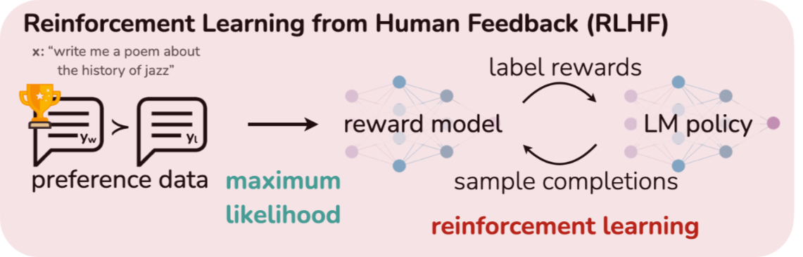

## RLHF/PPO
RLHF和PPO源于传统强化学习领域，属于一种post training 方法，核心是用一个reward model (也可以认为是特殊的teacher model)引导已经SFT的llm返回更加符合使用者偏好的输出。

RLHF框架图如下：

有了带有偏好性的数据集之后，先使用数据集训练reward model学会区分偏好响应与较劣响应，再使用PPO结合reward model与LLM用RL范式重新训练。

RLHF的训练目标如下：

$$ \max_{\eta} \mathbb{E}_{z \sim D_y, \eta(y|z)} [r(x,y)] - \beta D_{KL} [\eta(\theta|y) \| \pi_{ref}(y|x)] $$

其中$r(x,y)$是奖励模型根据llm输出给出的好坏评估分数，$\pi_{ref}(y|x)$是参考策略（可以认为是给定输入x的情况下，llm输出y序列作为响应的概率），通常用已经SFT好的llm初始化。整体目标为最大化reward model评分输出的同时尽量控制和策略模型的KL散度。$\beta$是用来控制偏移程度的超参数。

### small talk: 为什么RLHF需要采样？

从RLHF的训练公式中可以看出，方法本质上做的一件事是在最大化输出期望值。既然是期望值，理想状态下是对一个连续输出空间求积分，而对于llm这种响应空间可达上亿指数级（输出序列y的所有可能情况）的特例，自然无法穷举计算求和，因此必须采样，用样本平均来逼近期望（也就是Monte Carlo）来表示模型输出响应空间期望的整体情况。采样质量不好，可能会导致模型陷入局部最优解，也有可能导致模型只给出单一最高概率值响应，而不去探索潜在的高评分响应。

初代RLHF采用PPO指导RL部分的训练，近端策略梯度算法也需要大量采样。我们常说的采样都是在线的，因此也需要消耗大量算力和时间。

## DPO
DPO相比于PPO直接优化是不需要采样步骤。

前文提到的RLHF的优化目标的最优解可以显式解出来：

\[ \pi^*(y|x) = \frac{1}{Z(x)} \pi_{ref}(y|x) \exp \left( \frac{1}{\beta} r(x,y) \right) \]

其中$Z(x)$是归一化常数：

\[ Z(x) = \sum_y \pi_{ref}(y|x) \exp \left( \frac{1}{\beta} r(x,y) \right) \]

可以认为最优策略是参考策略的加权表示，而这个权重由奖励模型决定。

奖励函数可以被解出来：

\[ r(x,y) = \beta \log \frac{\pi^*(y|x)}{\pi_{ref}(y|x)} + \beta \log Z(x). \]

这里，奖励被分解为两部分：第一项捕捉策略相对于参考的偏好，第二项是归一化偏移。接下来，在DPO中采用Bradley-Terry偏好模型建模人类偏好，对于给定prompt $x$，偏好响应优于劣等响应的概率为：

\[ P(y_w > y_l | x) = \sigma \left( r(x, y_w) - r(x, y_l) \right) \]

$\sigma$是simoid函数。
带入上面显式求解的奖励：

\[ P(y_w > y_l | x) = \sigma \left( \beta \log \frac{\pi^*(y_w | x)}{\pi_{ref}(y_w | x)} - \beta \log \frac{\pi^*(y_l | x)}{\pi_{ref}(y_l | x)} \right) \]

我们可以发现DPO消除了对reward model的依赖，因为$r(x,y)$被策略$\pi(.)$表示出来了。也可以发现DPO摆脱了对RL那一套范式的依赖，现在可以直接在偏好数据上进行最大化似然训练，而不需要采样和梯度策略。

基于上述偏好概率，DPO 的损失函数设计为一个负对数似然损失，类似于二元交叉熵分类任务：目标是最大化模型预测的偏好概率与人类偏好数据的匹配度。具体公式为：

\[ L_{\text{DPO}}(\pi_\theta; \pi_{\text{ref}}) = -\mathbb{E}_{(x,y_w,y_l) \sim D} \left[ \log \sigma \left( \beta \log \frac{\pi_\theta(y_w | x)}{\pi_{\text{ref}}(y_w | x)} - \beta \log \frac{\pi_\theta(y_l | x)}{\pi_{\text{ref}}(y_l | x)} \right) \right] \]

