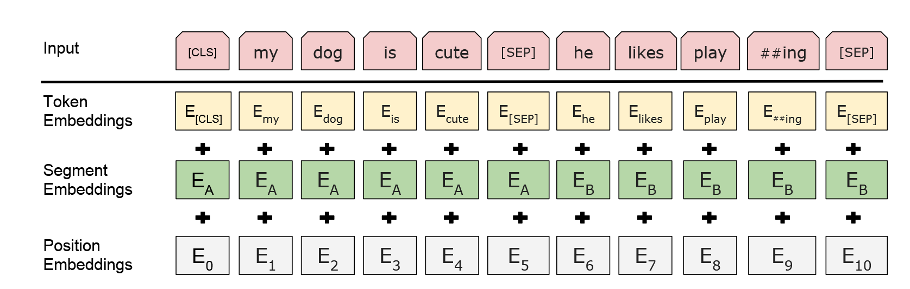

## RAG
### Intro
LLM面对知识密集型任务时暴露了几个问题：
- 面对generation task, llm给出的回答信息量不足，描述不够准确，在细粒度操作方面明显不如专门为特定任务制定架构的大模型。
-无法解释清楚知识来源。

问题本质可以归因为原始训练数据集和模型参数记忆能力的局限，要想一次性学完所有的知识，一方面数据集的涵盖范围不可能那么大，另一方面模型的遗忘灾难也使模型很难针对要求任务的细节给出满意的操作。

### Methology
既然大模型的参数记忆能力有限，那么就考虑将模型的记忆分成两部分：参数化记忆与非参数化记忆。
参数化记忆顾名思义，就是在训练过程中嵌入模型参数的知识。参数化记忆这部分保持不动，人为引入非参数化部分，可以理解为针对请求的任务到特定的知识库中调取文档，让模型结合文档内容给出更加专业并具有针对性的回答。

具体方式：RAG分为两大块，检索器与生成器，检索器用于在给定的知识库中调取文档，调取方法为通过bi-encoder将文档和query映射到LLM embedding space，取点积最大者作为附加上下文。

生成方式有两种，按序列生成与逐token生成，前者在生成一个完整序列的时候基于同一个文档，而后者在生成每一个token的时候都可以检索新的文档。

RAG-Sequence:

$$p_{\text{RAG-Sequence}}(y|x) \approx \sum_{z \in \text{top-k}(p(\cdot|x))} p_{\eta}(z|x) p_{\theta}(y|x, z) = \sum_{z \in \text{top-k}(p(\cdot|x))} p_{\eta}(z|x) \prod_{i} p_{\theta}(y_i|x, z, y_{1:i-1})$$

RAG-Token:

$$p_{\text{RAG-Token}}(y|x) \approx \prod_{i}^{N} \sum_{z \in \text{top-k}(p(\cdot|x))} p_{\eta}(z|x) p_{\theta}(y_i|x, z, y_{1:i-1})$$

整体是一种端到端，一体化的训练结构。

## Agent

## BERT
### Challenge

NLP任务中很多时候单向注意力并不够用。GPT所使用的decoder-only结构适合应付文本生成任务，而对文本答案不定，前后文关系紧密的任务则不适用。例如，在多轮问答中，问题答案很可能出现在后面的句子：

```
A: How do you go to school today?

B: By bike. 
```

我们可以看到如果要回答如何来上学这个问题，需要结合下文的内容。但是单纯让模型做双向注意力会导致模型在预测一个token的时候“看得见自己”，给出的回复过于trival。

### Method

BERT解决问题的思路是：只用transformer的encoder完成双向注意力机制。先看BERT的输入层：



BERT的token embedding实际上是一个有着30552个单词的look-up表，限定每个单词的特征维度为728维。Segment Embedding 表示句子类型，例如在问答中，问句是句子A，下一句答复是句子B，则两个句子的segment 部分的值分别为全1与全0，用以区分问句和答句。对于非问答类的比如分类任务的句子，所有句子类型相同，segment 全0即可。

和transformer的余弦position embedding不同，BERT用了一个可以学的位置嵌入。同样是一个look-up表，BERT限定能同时处理的token上限是512，因此这张表的尺寸也是$512 \times 768$，每$i$行的每一个值表示该第$i$个token的位置编码。

结束输入来看架构。BERT主体架构很简单，就是transformer的几个encoder叠在一起。BERT性能sota的秘诀在于pre-train。在预训练阶段，采用了一种类似于完形填空的手段：随机选15%的词出来，其中80%的词挖掉置[Mask], 10%的词随机换成其他的词，剩下10%不变。这种MLM训练任务让BERT有非常好的上下文理解能力。之后还有NSP训练任务，只是后来的研究发现NSP对提升语言模型理解能力并没有太大帮助，因此不多说。

### Key
- BERT是一种双端注意力机制语言理解模型，关键在于理解，因此BERT用来生成用于做分类或者其他任务的文本表示，本身不生成文本，也没有decoder。
- MLM Benchmark是一项宝贵的训练手段，后续也有相当多的模型训练将MLM纳入pre-train框架中。掩码预测这种完形填空式的任务能有效增强模型对上下文的注意力。